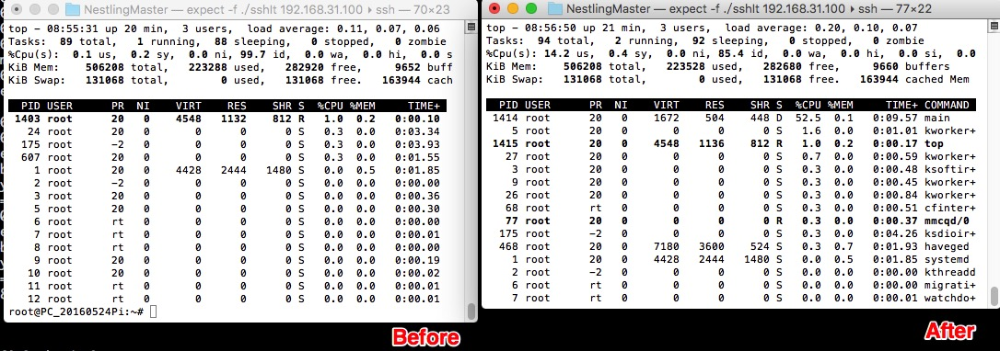

# OrangePi_FBCP

参考了rpi-fbcp,同样用于复制Framebuffer内容,只是没有用到底层的硬件加速,因此速度会变慢,但是增强了移植性

Develop By KameraSui ~
2017

Feel Free To Use & Distribution

### Usage/用法

PiFBCP   fb_from   fb_to

例如   PiFBCP 0 1 把framebuffer设备/dev/fb0的内容复制到/dev/fb1

### Limit/限制

1. 复制源和目标设备分辨率相同
2. 复制源像素为32位或者24位,目标设备为16位,所以就是典型的 VideoDevice -> TFT Monitor

### Compile/编译

gcc -o  PiFBCP PiFBCP.c

### Performance/性能

开启前后'top'对比

@320x240x16bit

### Problems/问题

缺乏GPU加速

### Test/测试

在OrangePi Lite上测试通过

------

Inspired By

tasanakorn/rpi-fbcp

https://github.com/tasanakorn/rpi-fbcp

linux__frameBuffer__操作2--写入和截屏

http://blog.csdn.net/sno_guo/article/details/8439000